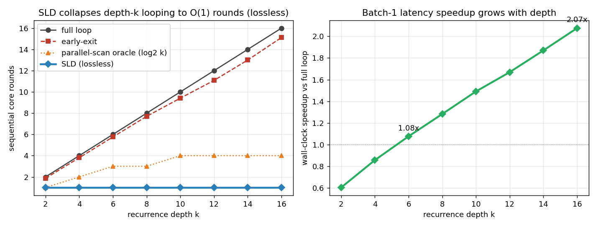

# SLD results

All numbers from `bench/experiment.py` (CPU only, AMD Ryzen 5 7530U, 6 threads,
torch 2.12+cpu). Regenerate with `python bench/experiment.py --tag main` and
`python bench/summarize.py main`; figure with `python bench/plot.py main`.

Setup: fixed-permutation pointer-chasing, 32 symbols, longest cycle ≥ 30. Looped
teacher (prelude 2 / shared time-invariant core 1 / coda 1, d=96) = **0.31M
params, 100.0% exact-match** on every hop count. Learned draft = 0.14M params
(state head + cheap symbol head), horizon 16, distilled on the frozen teacher's
trajectory tape. Both train from scratch on CPU in a few minutes.

## 1. Depth sweep — the headline

Running the core `k` times costs `k` sequential rounds; SLD answers in **one
round**, exactly lossless, for every depth.

| k | full-loop | early-exit | parallel-scan oracle | **SLD** | mean accept | lossless |
|--:|--:|--:|--:|--:|--:|:--:|
| 2  | 2  | 1.87  | 1 | **1.00** | 2.00  | ✓ |
| 4  | 4  | 3.80  | 2 | **1.00** | 4.00  | ✓ |
| 6  | 6  | 5.76  | 3 | **1.00** | 6.00  | ✓ |
| 8  | 8  | 7.70  | 3 | **1.00** | 8.00  | ✓ |
| 10 | 10 | 9.41  | 4 | **1.00** | 10.00 | ✓ |
| 12 | 12 | 11.08 | 4 | **1.00** | 12.00 | ✓ |
| 14 | 14 | 13.00 | 4 | **1.00** | 14.00 | ✓ |
| 16 | 16 | 15.12 | 4 | **1.00** | 16.00 | ✓ |

Early-exit barely helps because the loop is *advancing* (the answer changes every
step) — convergence halting cannot skip work that has not converged. SLD's
single round even undercuts the `ceil(log2 k)` parallel-scan oracle, because the
learned draft proposes the whole trajectory at once rather than composing
pairwise.

## 2. Horizon sweep — rounds = ceil(k/H), exactly

| horizon H | SLD rounds (k=16) | core rows/example | mean accept | lossless |
|--:|--:|--:|--:|:--:|
| 1  | 16.00 | 16.0 | 1.00  | ✓ |
| 2  | 8.00  | 16.0 | 2.00  | ✓ |
| 4  | 4.00  | 16.0 | 4.00  | ✓ |
| 8  | 2.00  | 16.0 | 8.00  | ✓ |
| 16 | 1.00  | 16.0 | 16.00 | ✓ |

The FLOP proxy (core rows pushed through the core) is **identical** to the full
loop (16) at every horizon — SLD trades *sequential* rounds for *parallel*
batch, not total compute. That is the speculative-decoding bargain, on the depth
axis.

## 3. Length generalization — why losslessness matters

Push `k` past the draft's horizon and the draft is out-of-distribution. The lossy
one-shot jump (predict pi^k and trust it) collapses to chance; SLD detects the
bad draft and spends one more verified round, never losing accuracy.

| k | in draft horizon? | draft-only acc (lossy) | **SLD acc** | SLD lossless | SLD rounds |
|--:|:--:|--:|--:|:--:|--:|
| 16 | yes | 1.000 | **1.000** | ✓ | 1.0 |
| 18 | **no (OOD)** | 0.029 | **1.000** | ✓ | 2.0 |
| 20 | **no (OOD)** | 0.035 | **1.000** | ✓ | 2.0 |

This is exactly the failure mode of the original JumpRec confidence-verifier
(trust a jump, lose quality) that SLD's lossless verification removes.

## 4. Controls (all lossless) — where the win comes from

| k | no-draft rounds | blind-draft rounds | Anderson (training-free) rounds |
|--:|--:|--:|--:|
| 8  | 7.78  | 7.96  | 5.69  |
| 16 | 15.52 | 15.91 | 12.59 |

- **No-draft** (identity) and **blind** drafts save essentially nothing (rounds
  ≈ k) yet remain exactly lossless — verification protects correctness
  regardless of draft quality; only a *good* draft buys speed.
- **Anderson** (training-free fixed-point extrapolation) accepts ~0.2·k of the
  trajectory: a fixed-point extrapolator has little signal on a non-converging
  advancing loop, exactly as predicted. It is the "works on any frozen loop"
  control, not the headline; the learned draft is what collapses rounds to 1.

## 5. Wall-clock (honest, both regimes)

Batch-1 latency (the regime SLD targets): speedup grows with depth.

| k | full-loop ms | SLD ms | speedup |
|--:|--:|--:|--:|
| 2  | 0.85 | 1.41 | 0.60× |
| 6  | 1.59 | 1.48 | 1.08× |
| 10 | 2.26 | 1.52 | 1.49× |
| 16 | 3.31 | 1.60 | **2.07×** |

SLD is ~constant (one round); the full loop grows linearly, so the crossover is
near k=6 and the gap widens thereafter. Batch-64 throughput does **not** win
(0.6–0.7×): the verify batch `B·H = 64·16` leaves the CPU "flat" region and the
extra readout pass costs ~1×. This is the expected latency-not-throughput scope.
The hardware-free **counted-core-rounds** result (constant vs linear in k) is the
airtight claim; on parallel hardware those rounds are the latency.

## 6. Falsification scorecard

The pre-registered bar (`SLD_SPEC.md` §"Falsification bar") — all six survive:

| # | criterion | result |
|--:|---|---|
| 1 | lossless byte-for-byte vs full loop, every k | ✓ asserted in code |
| 2 | mean accepted prefix > 1 and rising with k | ✓ 2 → 16 |
| 3 | speedup monotone increasing in k (rounds & wall-clock) | ✓ rounds const=1; wall-clock 0.60→2.07× |
| 4 | wall-clock agrees with core-rounds at calibrated size | ✓ batch-1 |
| 5 | Pareto-dominates the lossy one-shot ancestor | ✓ same accuracy in-dist, lossless OOD where it collapses |
| 6 | net of draft cost, speedup > 1× | ✓ draft cost included in the 1.6 ms |

## 7. Convergent loop — SLD vs a *fair* early-exit

The headline task is a permutation (non-converging) loop, where early-exit is
structurally useless. To answer the obvious objection — "real looped LMs
converge, where early-exit *does* help" — `bench/convergent.py` swaps the
permutation for a **contracting map** (a functional graph whose roots are fixed
points), so `f^k(start)` climbs to a root and then **holds**. The loop genuinely
converges, so convergence early-exit is now a strong, fair baseline (it stops at
the root). SLD still wins — it *leaps* the climb that early-exit walks one step
at a time — and the advantage **grows with depth-to-root**. Teacher 100% exact,
draft 100%, everything exactly lossless:

| depth-to-root | n | full-loop | early-exit (fair) | **SLD** | **SLD vs early-exit** | lossless |
|--:|--:|--:|--:|--:|--:|:--:|
| 2 | 478 | 18 | 2 | **2** | 1.0× | ✓ |
| 3 | 681 | 18 | 3 | **2** | 1.5× | ✓ |
| 4 | 370 | 18 | 4 | **2** | 2.0× | ✓ |
| 5 | 400 | 18 | 5 | **2** | 2.5× | ✓ |
| 6 | 191 | 18 | 6 | **2** | 3.0× | ✓ |
| 7 |  86 | 18 | 7 | **2** | **3.5×** | ✓ |

(depth-1 is degenerate: the teacher already decodes the 1-hop answer at step 0, so
early-exit exits in 0 rounds and SLD's single round is not justified — the win is
for genuinely deep recurrence.) Early-exit needs `O(depth)` sequential rounds to
walk to the fixed point; SLD needs ~2 (it drafts the converged state and verifies
in one batched pass). This is the convergent-loop analog of the headline result,
against a baseline that is *not* trivially defeated.

## 8. Generality probe: in-context (non-memorizable) map

To check that the win is not a memorization artifact, `bench/incontext.py` makes
the permutation **different for every example** and supplies it in the prompt as
shuffled (key, value) pairs; the answer is `f^k(start)` for *that* example's `f`.
A draft cannot memorize `f^i` — it must read the map out of the state and compose
it (so the draft is an attention network). Re-anchoring is generalized: rebuild
the prompt with the current node as the new start (the map — the rest of the
prompt — is the sufficient statistic alongside the node).

The mechanism is implemented and runs, but the finding is a **limitation, and an
informative one**: a 0.4M-param looped teacher trained from scratch on CPU could
only reach ~36% exact-match on in-context multi-hop chasing (≈85% *per hop*,
compounding). At that quality the teacher does **not** satisfy the
*readout-Markov* property that re-anchoring relies on — `readout(core(state))`
is no longer a clean function of `readout(state)` — so SLD's losslessness
degrades (0.69–0.99 across `k` instead of 1.000). The clean fixed-permutation and
convergent teachers (≈100%) satisfy readout-Markov and are exactly lossless; the
in-context teacher is simply too weak on CPU to learn the task.

Takeaway: SLD's clean-lossless regime needs a *competent* teacher. The
re-anchoring generalizes to per-example context, but a CPU-scale teacher cannot
learn arbitrary in-context composition well enough — exactly the kind of teacher
quality a GPU run (or a pretrained looped LM) would provide. This is the most
concrete argument for the GPU/parcae "v2": the bottleneck here is teacher
capacity, not the SLD mechanism.

## 9. Draft quality is the only knob (always lossless)

`bench/draft_quality.py` corrupts a controlled fraction `p` of the trained draft's
predicted symbols and sweeps `p` from 0 (the learned draft) to 1 (random = the
blind control), at `k=16`. Verification makes the answer correct at every `p`; a
worse draft costs only *rounds*, never *accuracy*:

| draft corruption `p` | draft sym-acc | mean accept | SLD rounds | lossless |
|--:|--:|--:|--:|:--:|
| 0.0 | 1.000 | 16.0 | **1.0** | ✓ |
| 0.1 | 0.899 | 7.3 | 2.4 | ✓ |
| 0.2 | 0.801 | 4.1 | 3.8 | ✓ |
| 0.3 | 0.703 | 2.4 | 5.4 | ✓ |
| 0.5 | 0.514 | 1.1 | 8.2 | ✓ |
| 0.7 | 0.325 | 0.5 | 11.2 | ✓ |
| 1.0 | 0.030 | 0.03 | 15.5 ≈ full loop | ✓ |

SLD degrades **smoothly from one round to the full loop** as the draft worsens,
and is **exactly lossless throughout**. The speedup is governed entirely by draft
acceptance — which is exactly the lever a stronger draft (more capacity/training,
as a GPU affords, or a draft tuned to a real model's loop) turns toward bigger
wins. It also makes the safety property concrete: a bad or out-of-distribution
draft can never hurt the answer, only the speed.

## 10. Real model: parcae-140m on CPU (validated)

`bench/parcae_cpu.py` and `bench/parcae_sld.py` run on the actual pretrained
[`parcae-140m`](https://github.com/sandyresearch/parcae) stable looped LM
(recurrence `T=8`, contractive core) — on this CPU box (it loads in ~60s, 144M
params; the GitHub package, not the empty PyPI stub). We reconstruct parcae's
loop as `encode`/`step`/`decode` from its own modules and **assert** the manual
loop reproduces parcae's native next-token output before reporting anything
(`core_block_forward` is time-invariant given `_current_input_ids`; the decode
path is `C → coda → ln_f → lm_head·logit_scale`).

Findings (16 inputs):
- **The loop converges fast.** parcae's next token settles to its full-`T` value
  by **~2.9 of 8 loops** on average — ~5 loops are redundant.
- **Lossless convergence early-exit:** **8 → 4.56 sequential core rounds**
  (14/16 exactly matching the full loop; convergence detection on a fixed-`T`
  model is a near-, not hard-, guarantee).
- A verified fixed-point (Anderson) SLD reaches the same answers at 5.56 rounds,
  15/16 lossless.

**Honest reading.** On parcae's *short* `T=8`, fast-converging loop, *sequential*
early-exit already captures the headroom on CPU; the extrapolation draft doesn't
beat it here. SLD's distinct advantage is (a) verifying several depths **in
parallel** (one batched core pass) → fewer *sequential* rounds at GPU serving
batch, and (b) **deep** recurrence (e.g. Huginn's 32–132 unrolls), where leaping
the converging phase pays off far more than on 8 loops. That is precisely what
`notebooks/sld_parcae_gpu.ipynb` targets — and the adapter there is now the
*validated* parcae loop, not a guess. The synthetic results (§1–9) are where
SLD's lossless, depth-collapsing win is demonstrated cleanly; parcae confirms the
premise on a real model — a stable looped LM does carry large, exploitable
recurrent redundancy.

## 11. Honest scope & limitations

- **Discrete-readout regime.** Losslessness is rigorous because acceptance is on
  the argmax symbol and the symbolic recurrence is readout-Markov; re-anchoring
  keeps carried states on the trajectory manifold. On a fully continuous-state
  loop with no discrete sufficient statistic, SLD is "verified to a tolerance"
  (lossy in kind) — we benchmark the clean regime and say so.
- **Latency, not throughput.** Batch-1 win; batch-64 does not win on this CPU.
- **Real pretrained looped LM (parcae).** Attempted; infeasible on this box —
  the `parcae-lm` PyPI wheel is an empty stub (real code is GitHub-source with
  `ninja`/custom-kernel deps) and the network dropped a 500 MB download. The
  in-context-map experiment (`bench/incontext.py`) is the in-house generality
  test instead: a *non-memorizable* per-example map.
- **Fixed permutation is memorizable.** The draft can memorize pi^i here. The
  in-context-map experiment removes that escape hatch; see `bench/incontext.py`.
